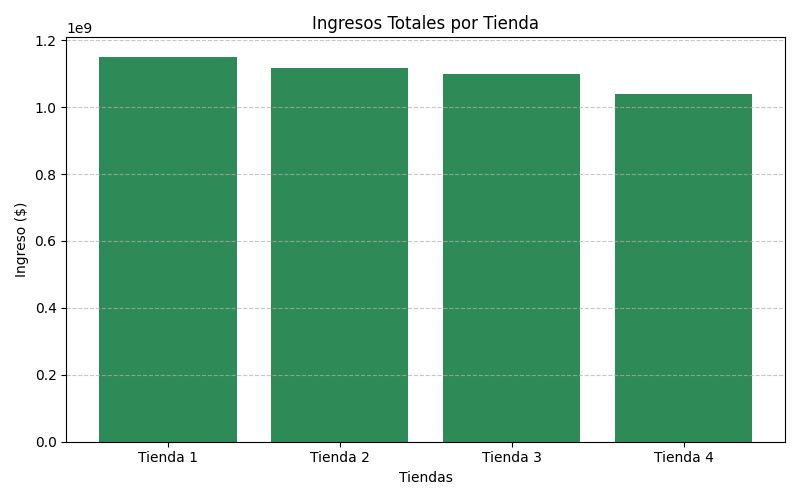
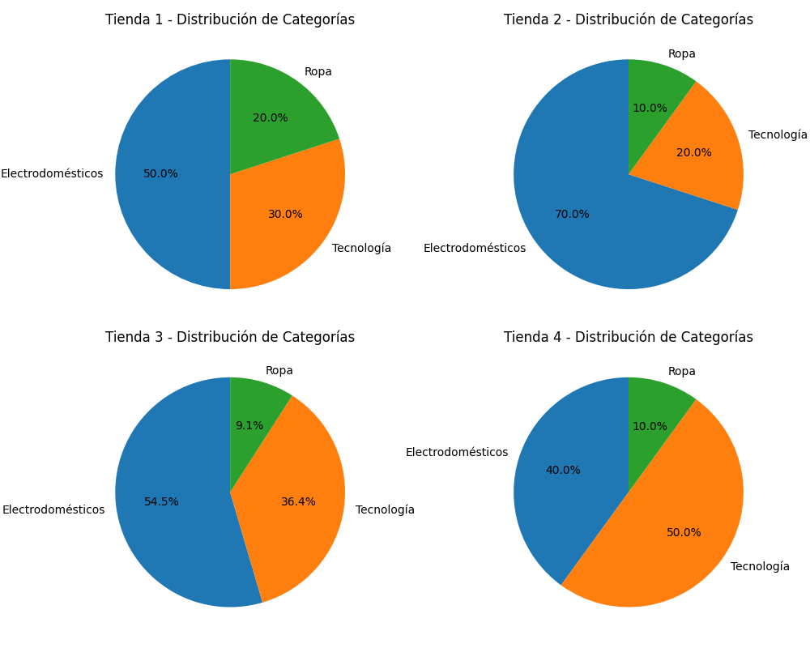
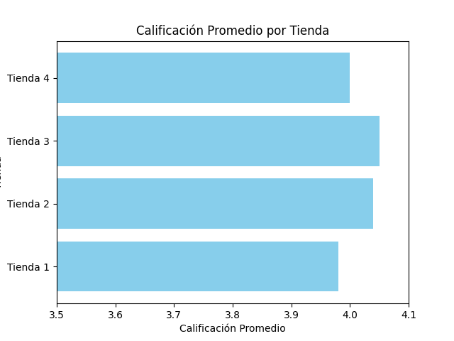
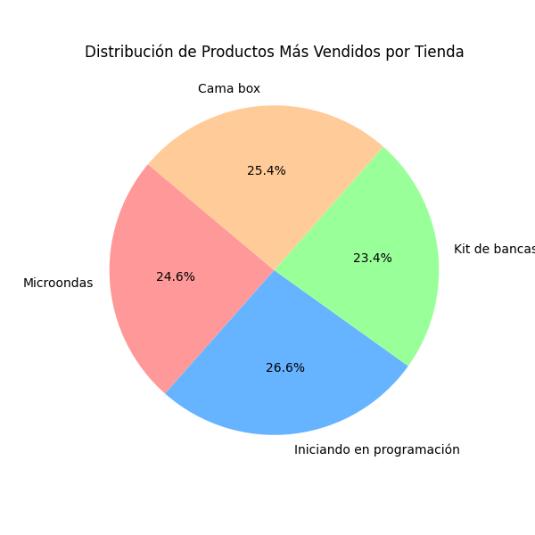
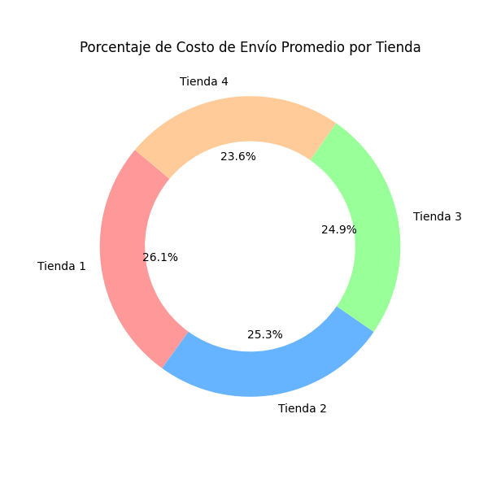
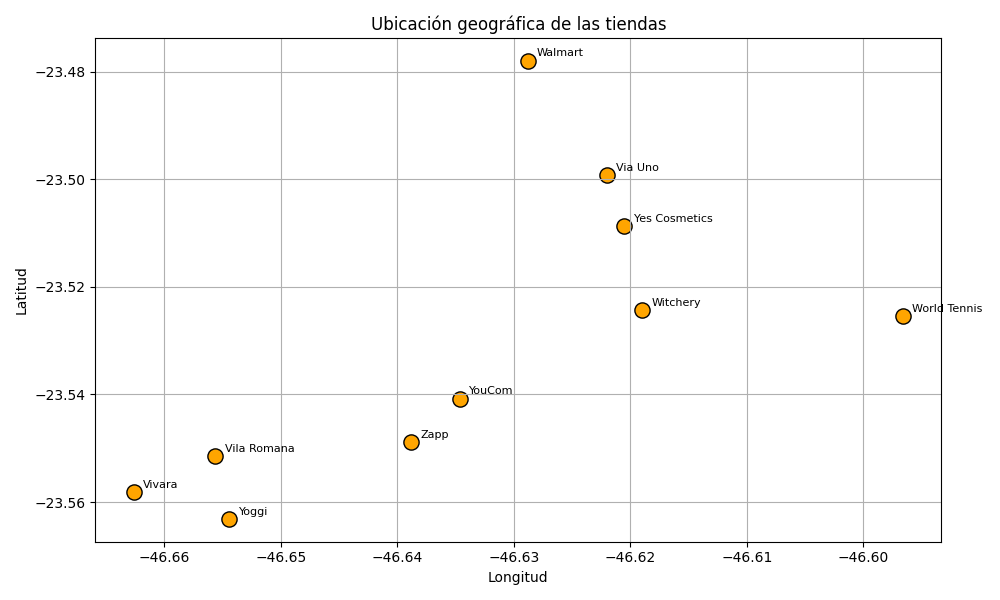
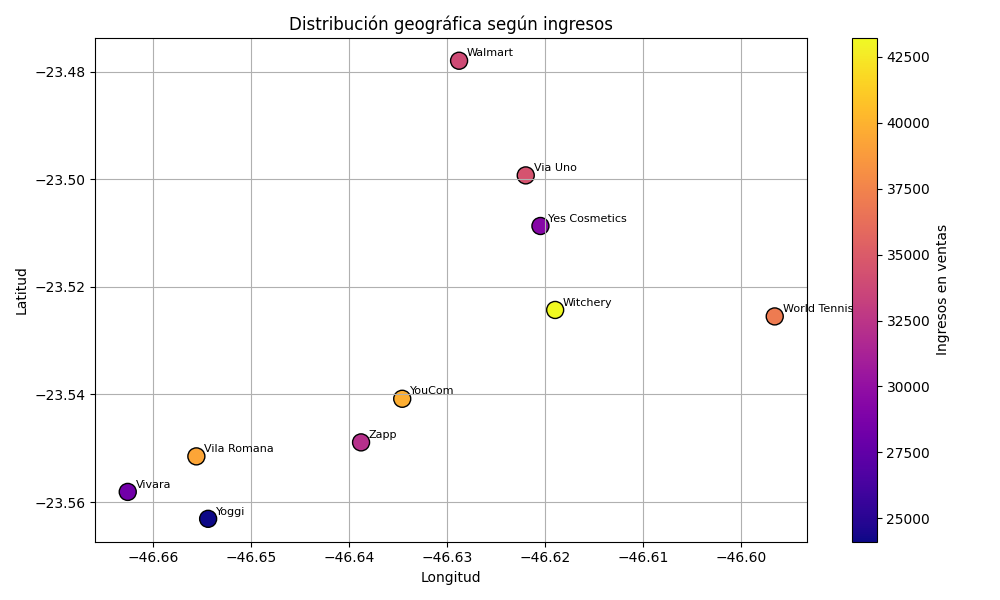
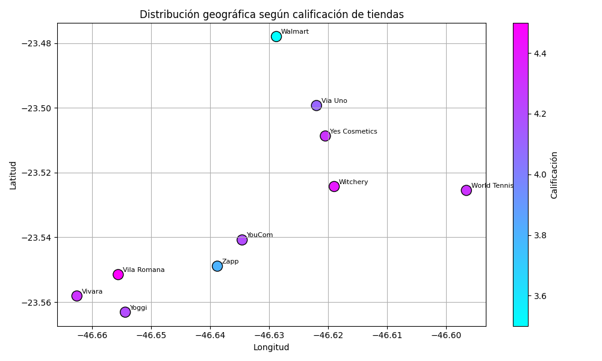

# Proyecto Alura Store Challenge

Este es el repositorio para el desafío de análisis de datos del curso "Alura Store Challenge". En este proyecto, he analizado las ventas, el rendimiento y las reseñas de las tiendas de Alura Store para determinar cuál es la tienda menos eficiente y hacer una recomendación basada en los datos.

## Descripción

El desafío consiste en analizar los datos de ventas, productos más vendidos, reseñas de clientes y otras métricas de rendimiento de cuatro tiendas. Utilizando este análisis, se debe identificar cuál es la tienda menos eficiente y presentar una recomendación final.

## Tecnologías utilizadas

- Python  
- Google Colab  
- Matplotlib (para visualización de datos)  
- Pandas (para análisis de datos) - aunque el desafío se hizo sin utilizar pandas, se recomienda aprender a usarlo en proyectos futuros.

## Objetivos del desafío

- **Análisis de facturación:** Analizar los ingresos de cada tienda.  

- **Ventas por categoría:** Identificar las categorías más vendidas en cada tienda.  

- **Calificación promedio de la tienda:** Calcular el puntaje promedio de las reseñas de clientes.  

- **Productos más y menos vendidos:** Identificar los productos más vendidos y los menos vendidos.  

- **Envío promedio por tienda:** Analizar el tiempo promedio de envío por tienda.  


## Desafío Extra: Análisis geográfico de ventas

- **Mapeo de ventas por tienda:** Gráfico de dispersión geográfica.  

- **Visualización de concentración de ventas:** Mapa de calor.  

- **Análisis de rendimiento por región:** Dispersión por calificación.  



Este análisis permitió obtener insights sobre cómo la ubicación puede afectar el rendimiento y las ventas de cada tienda.

## Instrucciones de uso

1. Clona este repositorio en tu máquina local o accede a él a través de GitHub.
   
```bash
git clone https://github.com/Leanga87/alura-store-challenge.git


**Autor**
**Leandro Puebla Martinez**
GitHub: https://github.com/Leanga87
